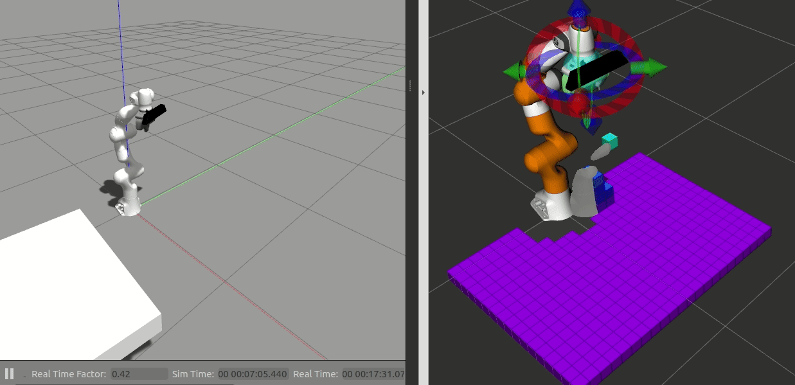

# moveit_experiments_spring_2021
A package where CURC members are experimenting with moveit.

- [x] Adding rgb-d camera
- [ ] make moving vehicle with platform for object
- [ ] connect joints with moveit interface
- [ ] segment object from flat platform
- [ ] TBD
- [ ] TBD
- [ ] TBD
- [ ] TBD



# BASIC USAGE
catkin_make it, source it, and then run 
```
roslaunch panda_simulation simulation.launch
```

# REQUIREMENTS
```
sudo apt-get update
sudo apt-get install ros-noetic-move-base -y
sudo apt-get install ros-noetic-map-server -y
# NOT AVAILABLE # sudo apt-get install ros-noetic-eband-local-planner -y
sudo apt-get install ros-noetic-global-planner -y
```
