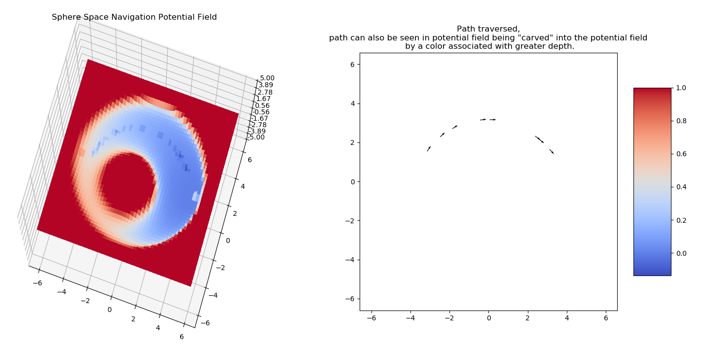
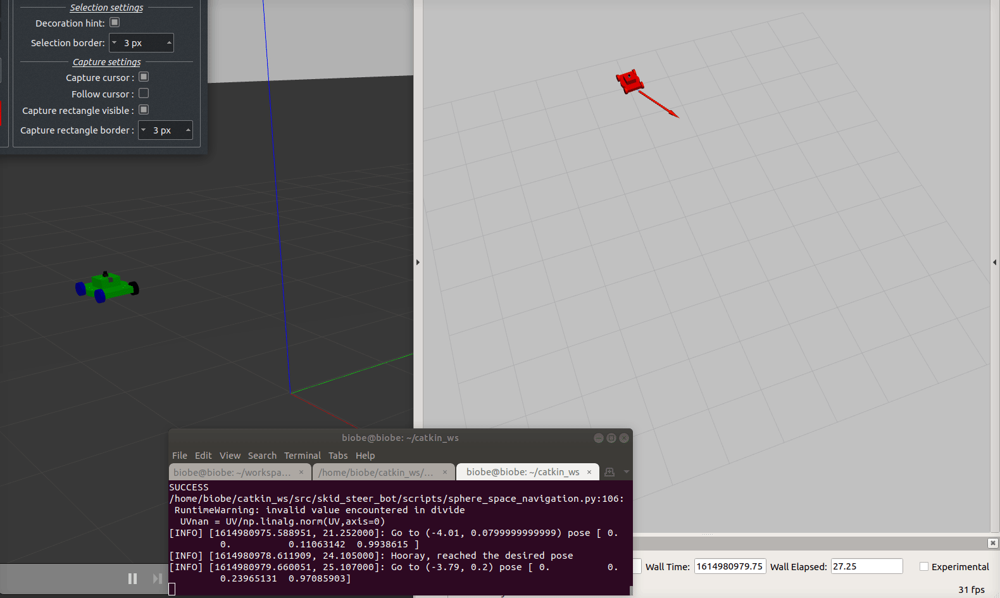

# Sphere Space Navigation Test
A repo developed on Friday March 5th.



## Project website

This repository is meant to demonstrate a ROS implementation of path planning via Sphere Space Navigation.

The Sphere Space Navigation is based on the following [paper](https://kodlab.seas.upenn.edu/uploads/Kod/Rimon92.pdf) 
``` E Rimonand D Koditschek. “Exact robot navigation using artificial potential functions”. 1992. ```


NOTE : The skid steer bot used was forked from [here](https://github.com/Heych88/skid_steer_bot).

## Prerequisites

1. Ubuntu 18.04 

2. ROS melodic

3. Install ROS nodes required for the local and global planners, amcl, maps and motor control for the navigation stack.

```sh
sudo apt-get update
sudo apt-get install ros-melodic-move-base -y
sudo apt-get install ros-melodic-map-server -y
sudo apt-get install ros-melodic-eband-local-planner -y
sudo apt-get install ros-melodic-global-planner -y
sudo apt install python-pip -y
pip install sympy
```

## Installing

```sh
mkdir -p ~/catkin_ws/src/
cd ~/catkin_ws/src/
git clone https://github.com/1hada/skid_steer_bot.git
cd ../
catkin_make
source devel/setup.bash
```

## Run the Code

In a terminal window, type the following,
```sh
cd ~/catkin_ws
roslaunch skid_steer_bot skid_steer.launch
```

In a new terminal, run the sphere space script via the move_base file.
```sh
cd ~/catkin_ws
source devel/setup.bash
rosrun skid_steer_bot move_base.py
```


Gazebo and Rviz will load and you should arrive at a result similar to the below.




## License

This project is licensed under the MIT License - see the [LICENSE.md](LICENSE.md) file for details.
